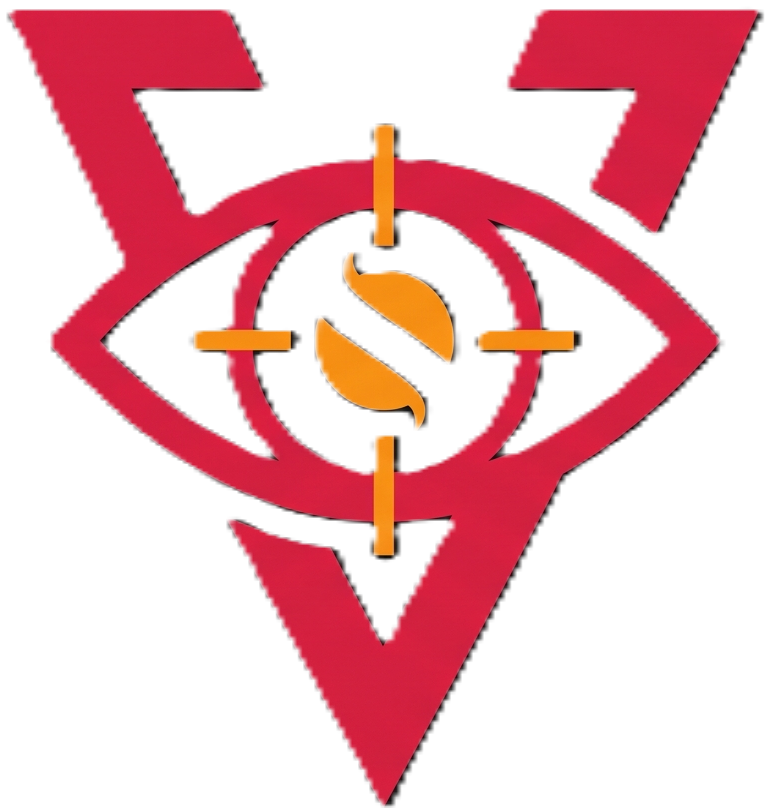

<h3 align="center">
  
  &nbsp;
  <strong>VulnSight</strong>
</h3>

  
  
  

## 📖 Deskripsi Aplikasi

**VulnSight** adalah platform *Automated Web Pentesting & SecOps Toolkit* berbasis web yang dirancang untuk memberikan pandangan mendalam (*insight*) dan taktis mengenai celah keamanan (*vulnerabilities*) aplikasi web. Didesain khusus untuk para praktisi keamanan siber, *Red Team*, dan *DevSecOps*.

Sistem ini beroperasi dengan arsitektur *asynchronous* (non-blocking) di sisi *backend*, memastikan performa UI tetap responsif meskipun sistem sedang melakukan *scanning* intensif di latar belakang.

## ✨ Fitur Utama

### 🎯 1. Automated Pentest Engine
* **Unauthenticated Scan (Pemindaian Publik):** Pemetaan *attack surface*, audit konfigurasi *Security Headers* (HSTS, CSP, X-Frame-Options), deteksi versi teknologi yang usang, dan pencarian cepat (*fuzzing*) pada 30-50 file sensitif yang sering bocor (contoh: `.env`, `.git`).
* **Authenticated Scan (Pemindaian Internal):** Mendukung injeksi *Cookie/Session Token* kustom untuk memindai area di balik halaman *login/dashboard* secara aman tanpa terhambat oleh CAPTCHA atau sistem Anti-Bot.

### 🛠️ 2. SecOps Toolkit Terintegrasi
* **CVSS Calculator:** Kalkulator interaktif untuk menghitung tingkat keparahan (*severity*) kerentanan berdasarkan metrik standar.
* **CVE Tracker:** Modul pencarian dan pelacakan *Common Vulnerabilities and Exposures* (CVE) untuk mendapatkan konteks ancaman secara cepat.
* **Tools:** Dilengkapi dengan utilitas tambahan seperti Encoder/Decoder, hashing, enkripsi, dan IP Geolocation.

### 🤖 3. Smart AI Integration (Groq Llama 3)
*Untuk menjaga performa dan menghindari pembatasan kuota (Rate Limit), AI diterapkan secara cerdas melalui skema Pasif (Post-Scan):*
* **Automated Remediation Generator:** Menghasilkan panduan perbaikan keamanan (*remediation*) instan beserta cuplikan kode pertahanan khusus untuk *tech-stack* target. Menggunakan sistem *caching database* agar hemat *resource*.
* **AI Executive Summary:** Secara otomatis menyusun narasi ringkasan eksekutif berstandar CISO untuk disertakan di halaman pertama laporan PDF.

### 📄 4. Professional Reporting
* Pembuatan laporan hasil pemindaian berformat PDF yang komprehensif, siap diserahkan kepada klien atau pihak manajemen.

---

## 🏗️ Arsitektur & Stack Teknologi

VulnSight dibangun menggunakan arsitektur *Decoupled (REST API)* dan *Single Page Application (SPA)*.

**Frontend (FE):**
* **Framework:** Vue.js 3 (Composition API, `<script setup>`)
* **Build Tool:** Vite
* **Router & State:** Vue Router 4 & Pinia
* **Styling & UI:** Tailwind CSS, Shadcn Vue, Lucide Icons

**Backend (BE):**
* **Core API:** FastAPI (Python 3.13)
* **Task Queue:** Celery + Redis (Background Worker)
* **Scanner Engine:** *Native script* Python (`httpx` async, `socket`, `ssl`, `python-Wappalyzer`)
* **Database:** MySQL (via Laragon)
* **AI Engine:** Groq API (Model: `llama3-8b-8192`)

